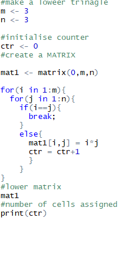
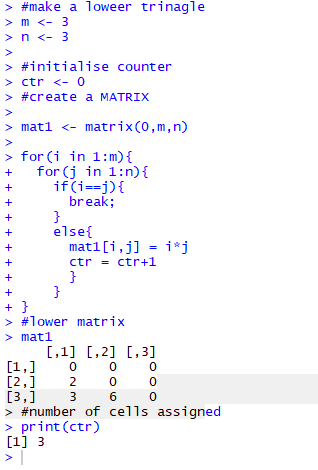

# Assignment3.1

Define an m x n matrix of zeros and then enters a nested-for loop to fill the
locations of the matrix, only if the two indexes differ.
• The purpose is to create a lower triangular matrix, that is a matrix whose
elements below the main diagonal are non-zero, the others are left
untouched to their initialized zero value.
• When the indexes are equal (if condition in the inner loop, which runs over
j, the column index), a break is executed and the innermost loop is
interrupted with a direct jump to the instruction following the inner loop,
which is a print; then control gets to the outer for condition (over the
rows, index i), which is evaluated again.
• If the indexes differ, the assignment is performed and the counter is
incremented by 1.
• At the end, the program prints the counter ctr, which contains the
#number of elements that were assigned.

code:

	

solution:

	
